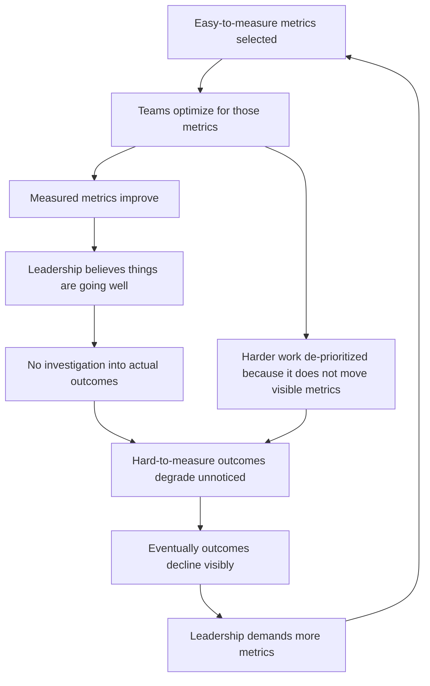
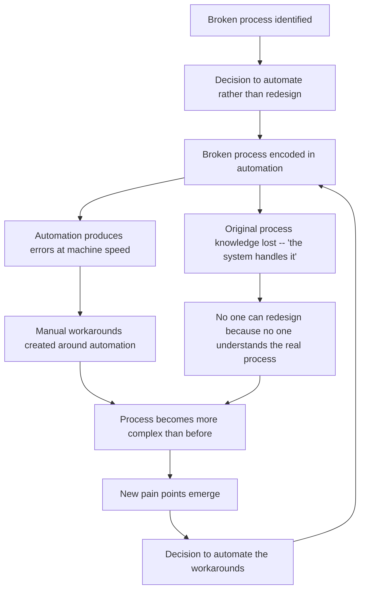
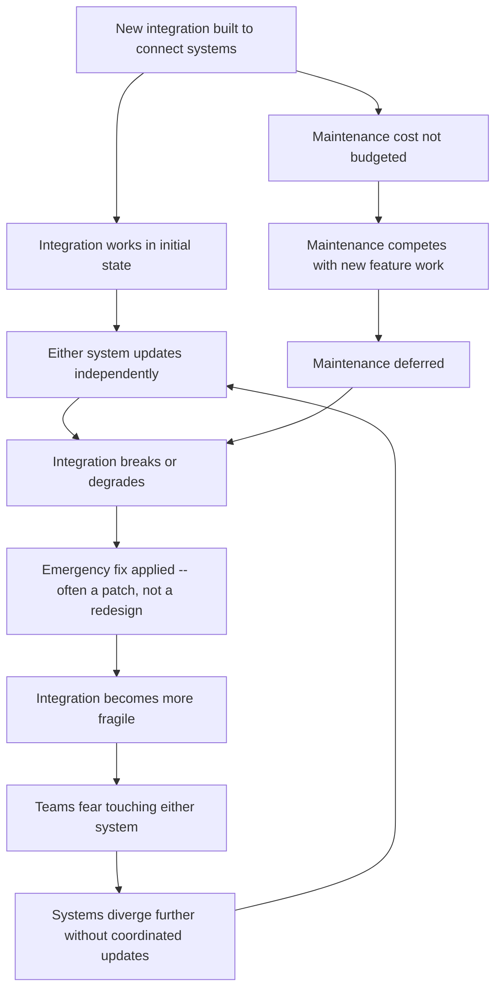
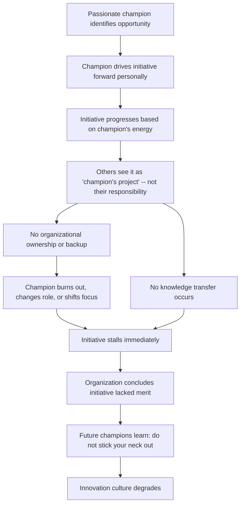
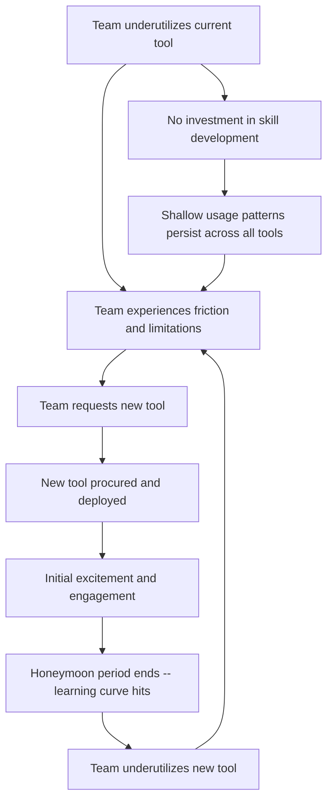
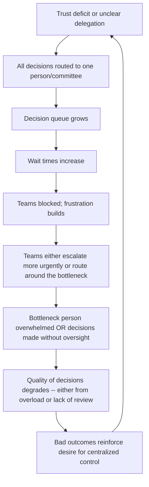
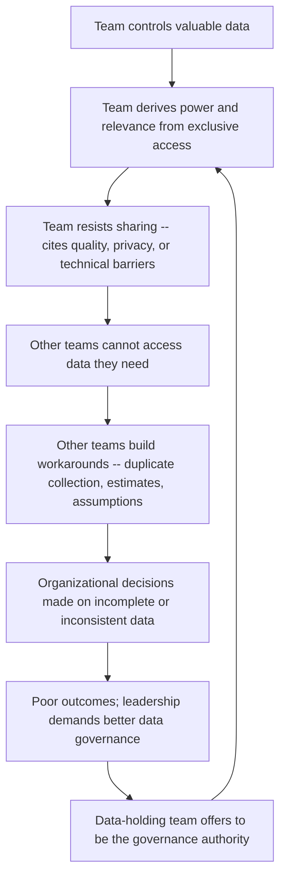
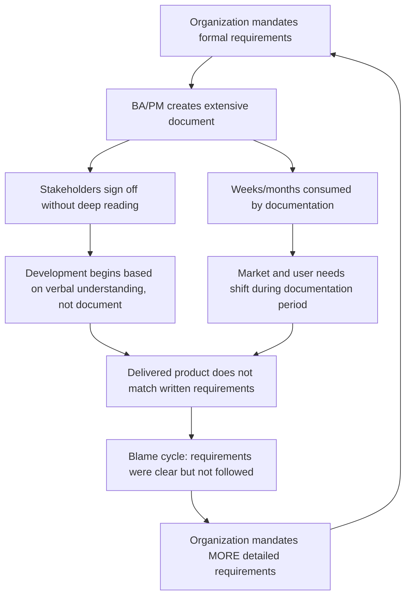
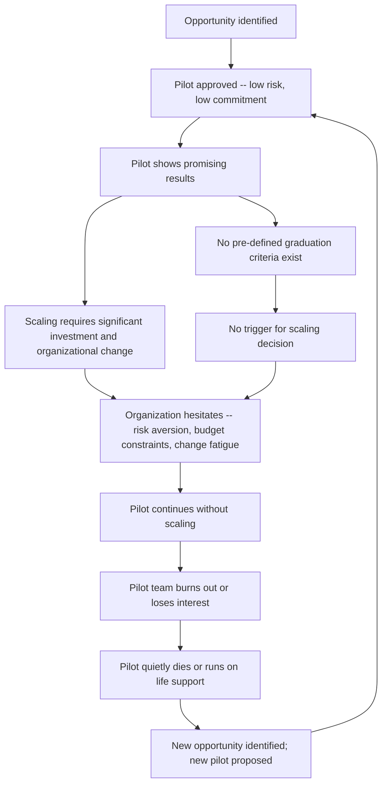
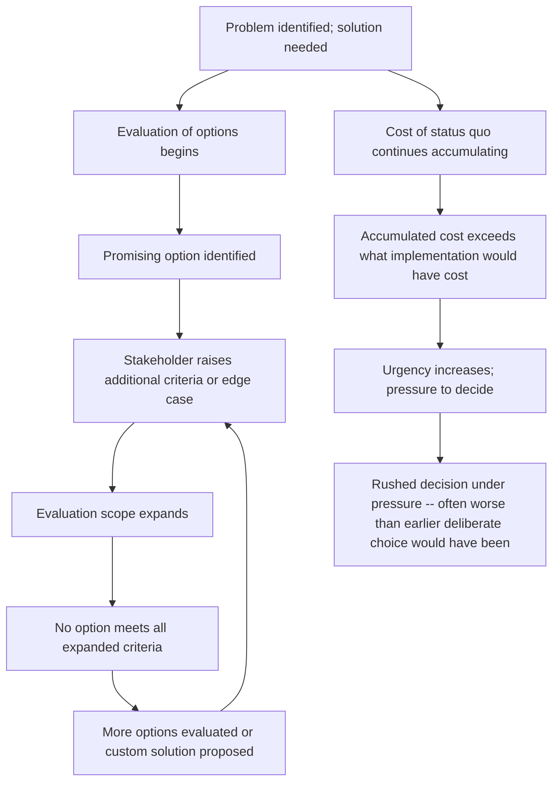

# Pattern Library Reference: Enterprise Technology and Process Anti-Patterns

*Expanded pattern library for Insight Analyst agents. Contains 10 additional patterns for enterprise technology and process analysis. For the foundational 5 patterns (Governance Vacuum, Data Quality Trap, Adoption Gap, Shadow IT Spiral, Scope Creep Doom Loop), see the primary pattern library.*

---

## How to Use This Library

Each pattern includes:
- **Symptoms**: Observable signals an analyst can detect during discovery interviews, document review, or data analysis
- **System Dynamics**: A reinforcing loop diagram showing how the pattern sustains itself
- **Intervention Points**: Where to break the cycle, ordered by effectiveness
- **Common Misdiagnosis**: What stakeholders typically think is happening vs. the actual root cause
- **Non-Build Resolution**: How to address the pattern through process, people, or governance changes -- without introducing new technology

When conducting DISCO Insight analysis, cross-reference findings against these patterns. If 3+ symptoms match, flag the pattern as a probable match and investigate the system dynamics to confirm.

---

## Pattern 1: Metrics Mirage

**Definition**: Teams optimize for easily measured metrics while ignoring hard-to-measure outcomes that actually matter. The metrics dashboard shows green while real performance degrades. Goodhart's Law in action: "When a measure becomes a target, it ceases to be a good measure."

### Symptoms

1. **Dashboard disconnect**: Stakeholders report that "all metrics are green" but business outcomes are declining or stagnant
2. **Gaming behaviors**: Teams restructure work to hit metric targets rather than deliver value (e.g., closing tickets prematurely, splitting work into smaller items to inflate throughput counts)
3. **Metric proliferation without culling**: New KPIs are added quarterly but none are retired, leading to 50+ metrics that no one reviews holistically
4. **Absence of outcome metrics**: All tracked metrics are activity-based (tickets closed, features shipped, meetings held) with no metrics tied to user adoption, revenue impact, or problem resolution
5. **"Watermelon" status reports**: Green on the outside (reported metrics), red on the inside (actual state)

### System Dynamics

### Intervention Points

1. **Introduce lagging outcome metrics** alongside leading activity metrics. For every "how much" metric, require a "so what" metric. Example: pair "features shipped" with "user adoption of shipped features at 30 days."
2. **Implement metric sunset reviews**: Every quarter, retire the 20% of metrics with the weakest link to outcomes.
3. **Conduct "metric inversion" exercises**: Ask "If we perfectly optimized this metric, would the business actually improve?" If the answer is uncertain, the metric is suspect.
4. **Require qualitative check-ins**: Monthly unstructured conversations with end users that bypass the metric framework entirely.

### Common Misdiagnosis

| What stakeholders think | What is actually happening |
|------------------------|--------------------------|
| "We need better metrics and more data" | The problem is not insufficient measurement but measurement of the wrong things |
| "Teams are performing well based on their numbers" | Teams are performing well at hitting numbers, not at achieving outcomes |
| "We just need a better dashboard" | The dashboard accurately reflects meaningless metrics; a better dashboard will display the same meaninglessness more attractively |

### Non-Build Resolution

- **Governance change**: Establish a quarterly "outcomes review" where leadership examines 3-5 actual user/business outcomes independent of any metric dashboard. Use narrative reporting (written summaries) rather than charts.
- **Process change**: Require every initiative proposal to declare its outcome metric upfront, and hold a 90-day retrospective on whether the outcome materialized. Separate the outcome review from the activity review.
- **People change**: Assign an "outcomes owner" distinct from the "delivery owner." The outcomes owner's success is measured by user/business impact, not by on-time delivery.

---

## Pattern 2: Automation Fallacy

**Definition**: Assuming that automating a broken process will fix it. Automating chaos produces faster chaos. The dysfunction gets encoded into the automation, making it harder to see and harder to fix.

### Symptoms

1. **"Automate it" as default response**: When process problems surface, the first proposed solution is always tooling or automation rather than process redesign
2. **Automated processes requiring constant manual intervention**: The automation runs but someone has to babysit it, fix its outputs, or handle its exceptions daily
3. **Error rates remain constant or increase after automation**: The same mistakes happen, just faster and at higher volume
4. **Nobody can explain the process end-to-end**: The pre-automation process was never documented or understood; the automation was built from tribal knowledge and assumptions
5. **"The system does it that way" justification**: Broken process steps are defended because "the tool requires it," when in fact the tool was built to match the broken process

### System Dynamics

### Intervention Points

1. **Mandate process mapping before any automation**: No automation project proceeds without a validated current-state process map reviewed by practitioners (not just managers).
2. **Require a "manual excellence" phase**: Run the redesigned process manually for 2-4 weeks before automating. If it does not work manually, it will not work automated.
3. **Track "automation exception rate"**: If more than 10% of automated runs require manual intervention, stop and redesign before continuing.
4. **Separate "process redesign" budget from "automation" budget**: Prevent the conflation of fixing with building.

### Common Misdiagnosis

| What stakeholders think | What is actually happening |
|------------------------|--------------------------|
| "We need a better tool" | The tool faithfully executes a flawed process; a better tool will execute the flawed process more efficiently |
| "The automation has bugs" | The automation correctly implements the wrong process; the bugs are process design flaws |
| "We need more training on the system" | People understand the system; they are working around the process flaws the system enforces |

### Non-Build Resolution

- **Process change**: Conduct a value stream mapping exercise for the end-to-end process. Identify and eliminate waste steps before any discussion of automation. Use the "Muda, Mura, Muri" framework to classify dysfunction.
- **Governance change**: Require every automation proposal to include a "process health assessment" sign-off from practitioners who execute the process daily (not managers who oversee it).
- **People change**: Create a "process analyst" role or responsibility distinct from "automation engineer." The process analyst's job is to simplify and fix; the automation engineer's job is to encode. They must not be the same person on the same initiative.

---

## Pattern 3: Integration Tax

**Definition**: The hidden, ongoing cost of maintaining integrations between systems. Organizations budget for initial integration development but systematically underestimate the perpetual maintenance burden: API version changes, authentication rotations, schema drift, rate limit adjustments, and break-fix cycles.

### Symptoms

1. **Recurring "integration maintenance" sprints**: Engineering regularly allocates unplanned time to fix integrations that were "done"
2. **One team's upgrade breaks another team's workflow**: System changes propagate through integrations in unexpected ways
3. **API version pinning**: Teams refuse to update dependencies because the integration is fragile, accumulating security and functionality debt
4. **Integration-specific tribal knowledge**: Only one person understands how a critical integration works; documentation is absent or outdated
5. **"We can't change that because it will break X"**: Integration coupling constrains the ability to improve individual systems

### System Dynamics

### Intervention Points

1. **Integration cost accounting**: Track actual hours spent maintaining each integration monthly. Make this visible to leadership alongside the integration's business value.
2. **Integration contracts**: Define explicit SLAs between integrated systems, including change notification windows, version support timelines, and break-fix responsibility.
3. **Reduce integration surface area**: Challenge every integration. Ask: "Can we eliminate this integration by consolidating systems, changing process, or accepting manual handoff?"
4. **Build integration health dashboards**: Monitor error rates, latency, and manual intervention frequency for every integration point.

### Common Misdiagnosis

| What stakeholders think | What is actually happening |
|------------------------|--------------------------|
| "We need better integration tooling" | The tooling is adequate; the problem is that integration maintenance is not planned, budgeted, or governed |
| "Our systems are unreliable" | Individual systems are fine; the integrations between them are unmanaged |
| "We need to standardize on one platform" | Platform consolidation can help, but often the integration tax transfers to intra-platform complexity rather than disappearing |

### Non-Build Resolution

- **Governance change**: Require every new integration to have a named owner, a documented maintenance budget (hours/month), and an annual review for continued necessity. Integrations without an owner get a 90-day sunset clock.
- **Process change**: Establish a cross-team "integration review board" that meets monthly to coordinate system changes, flag upcoming breaking changes, and prioritize integration maintenance.
- **People change**: Assign "integration stewards" who are responsible for monitoring and maintaining integration health across team boundaries. This is a part-time role, not a full-time position -- but someone must be explicitly accountable.

---

## Pattern 4: Champion Dependency

**Definition**: An initiative's survival depends entirely on one passionate advocate. When that champion changes roles, burns out, or shifts focus, the initiative collapses regardless of its technical merit or business value.

### Symptoms

1. **Single point of narrative**: Only one person can articulate why the initiative matters; others defer to them in all discussions
2. **Progress correlates with champion's availability**: When the champion is on vacation, out sick, or in a different project sprint, all momentum stops
3. **No executive sponsorship beyond the champion**: Leadership is aware of the initiative but has not formally committed resources or accountability
4. **Champion doing everything**: The same person is evangelizing, managing, building, and reporting -- roles that should be distributed
5. **Initiative absent from formal planning**: It exists in the champion's personal OKRs or task list but not in the team or department roadmap

### System Dynamics

### Intervention Points

1. **Formalize sponsorship early**: Require every initiative beyond prototype stage to have an executive sponsor (not the champion) who is accountable for outcomes.
2. **Distribute knowledge**: Mandate that the champion document and present to at least two other people who can continue the work.
3. **Embed in planning cycles**: If an initiative is worth pursuing, it belongs in the formal roadmap with allocated resources, not as a side project.
4. **Succession planning for initiatives**: Ask "If [champion] left tomorrow, who would continue this and what would they need?"

### Common Misdiagnosis

| What stakeholders think | What is actually happening |
|------------------------|--------------------------|
| "The initiative failed because it wasn't viable" | The initiative failed because its organizational support structure was a single person |
| "We need someone more senior to drive it" | Seniority is not the issue; distributed ownership is |
| "That person was just passionate about their pet project" | Passion is the symptom of someone seeing a real opportunity that the organization has not formally recognized |

### Non-Build Resolution

- **Governance change**: Implement a "two-sponsor rule" -- every initiative must have both a practitioner champion and an executive sponsor. If either disappears, the other triggers a continuity review.
- **Process change**: Create a quarterly "initiative health check" that assesses bus factor, knowledge distribution, and resource formalization for every active initiative.
- **People change**: Recognize and reward champions explicitly, but separate the "identifying opportunity" role from the "managing initiative" role. Champions should be scouts, not single-handedly responsible for building.

---

## Pattern 5: Training Avoidance Loop

**Definition**: Teams request new tools instead of learning existing ones properly. The perceived deficiency of the current tool is actually a skills gap, but acquiring a new tool is more exciting (and politically easier) than admitting the need for training.

### Symptoms

1. **Tool replacement cycle**: The same category of tool has been replaced 2+ times in 3 years with similar complaints each time
2. **Feature ignorance**: Teams complain about missing capabilities that already exist in the current tool but are unused
3. **Shadow tool proliferation**: Individuals adopt personal tools (spreadsheets, personal apps) to work around perceived limitations of the official tool
4. **"Training" means "onboarding"**: The only training is initial setup; no ongoing skill development or advanced usage education exists
5. **Vendor blamed for user problems**: Support tickets focus on "the tool should do X" when the tool already does X via a different workflow

### System Dynamics

### Intervention Points

1. **Utilization audit before procurement**: Before approving any new tool request, measure current tool utilization. If less than 50% of relevant features are actively used, the problem is likely training, not tooling.
2. **"Power user" programs**: Identify and develop internal champions who achieve deep proficiency and can train peers.
3. **30-60-90 day skill development plans**: Structure post-deployment training in phases, not a single onboarding session.
4. **Require "tried and failed" documentation**: New tool requests must include specific documentation of what was attempted with the current tool and why it failed.

### Common Misdiagnosis

| What stakeholders think | What is actually happening |
|------------------------|--------------------------|
| "The tool doesn't meet our needs" | The tool's capabilities are unknown because training investment was insufficient |
| "We need a more intuitive tool" | Every professional tool has a learning curve; "intuitive" often means "familiar" which requires time |
| "The vendor isn't responsive to our feature requests" | The requested features often already exist; the vendor recognizes this and deprioritizes the requests |

### Non-Build Resolution

- **Process change**: Implement a "tool mastery assessment" before any new tool evaluation begins. Teams must demonstrate they have explored advanced features, consulted documentation, and engaged vendor support before a replacement is considered.
- **People change**: Create "tool steward" roles within each team -- someone who maintains deep expertise and serves as first-line support. Budget 2-4 hours per month for this role.
- **Governance change**: Establish a "minimum utilization threshold" policy: tool replacement is not approved unless the current tool utilization exceeds 70% of relevant features and documented gaps remain.

---

## Pattern 6: Decision Bottleneck

**Definition**: All decisions funnel through one person or committee, creating delays that compound across the organization. The bottleneck often exists because trust is low, delegation is unclear, or the decision-maker does not realize they are the constraint.

### Symptoms

1. **Waiting is the dominant activity**: Teams spend more time waiting for approvals than executing work
2. **Meeting-driven decisions only**: Nothing moves forward without getting on a specific person's or committee's calendar
3. **Escalation as default**: Teams escalate even minor decisions upward rather than resolving locally
4. **Decision fatigue at the top**: The bottleneck individual/committee is overwhelmed, leading to delayed, rushed, or inconsistent decisions
5. **Workarounds and "forgiveness over permission"**: Teams start making decisions autonomously and hoping no one notices, because the formal path is too slow

### System Dynamics

### Intervention Points

1. **Decision rights framework**: Explicitly define which decisions can be made at which level. Use a RACI matrix or delegation framework.
2. **Decision categorization**: Classify decisions as Type 1 (irreversible, high-stakes -- centralize) vs. Type 2 (reversible, lower-stakes -- delegate). Most decisions are Type 2.
3. **Time-box decisions**: Any decision not made within its allotted timeframe defaults to the requestor's recommendation.
4. **Async decision protocols**: Create structured templates for async decision-making (proposal, options, recommendation, deadline for objections).

### Common Misdiagnosis

| What stakeholders think | What is actually happening |
|------------------------|--------------------------|
| "We need more decision-makers" | Adding more people to the bottleneck committee makes it worse. The issue is delegation, not headcount. |
| "The decision-maker is too slow" | The decision-maker is often appropriately cautious; the problem is that decisions that do not need their involvement are routed to them anyway |
| "We need a faster approval process" | Speed is not the issue; routing is. Most decisions should not require this approval at all. |

### Non-Build Resolution

- **Governance change**: Implement a tiered decision authority framework. Decisions below a defined threshold (dollar amount, reversibility, scope of impact) are made locally without escalation. Document the thresholds explicitly.
- **Process change**: Move to "decision by default" for Type 2 decisions: proposals are circulated with a deadline; silence equals consent. Only objections require discussion.
- **People change**: Coach the bottleneck individual on delegation. Often they are unaware they are the constraint, or they believe their involvement is necessary when it is not. Frame delegation as a trust-building exercise, not a loss of control.

---

## Pattern 7: Data Silo Fortress

**Definition**: Teams actively resist sharing data due to perceived power, control, job security, or competitive advantage within the organization. This goes beyond technical data silos (which are an infrastructure problem) -- this is a political and cultural pattern.

### Symptoms

1. **Data requests require executive intervention**: Getting access to another team's data requires escalation rather than a standard process
2. **"Our data isn't ready to share"**: Teams cite data quality concerns as a reason to withhold, but never invest in making it shareable
3. **Duplicate data collection**: Multiple teams collect the same information independently because they cannot access each other's sources
4. **Data hoarding as job security**: Individuals or teams derive their organizational value from being the sole holders of specific data
5. **Passive resistance to integration**: Teams agree in principle to share data but repeatedly delay, add conditions, or deprioritize the work

### System Dynamics

### Intervention Points

1. **Data ownership vs. data stewardship**: Redefine the relationship. Teams are stewards of organizational data, not owners. Stewardship includes a responsibility to share.
2. **Executive mandate with consequences**: Data sharing cannot be voluntary when it is culturally resisted. It requires top-down direction with clear expectations and accountability.
3. **Incentive realignment**: If people are rewarded for being data gatekeepers, they will remain gatekeepers. Reward data contribution and cross-team enablement.
4. **Standardize access, not data**: Rather than forcing data format standardization (which creates resistance), standardize the access mechanism (APIs, shared data catalog) and let teams maintain their own formats.

### Common Misdiagnosis

| What stakeholders think | What is actually happening |
|------------------------|--------------------------|
| "We have a technical data silo problem" | The technical barriers are surmountable; the resistance is political and cultural |
| "We need a data lake / data warehouse" | Building infrastructure does not address the human willingness to contribute data to it |
| "Teams just need to communicate better" | Communication is fine; incentives are misaligned. Teams are rationally protecting their power base. |

### Non-Build Resolution

- **Governance change**: Establish an organization-wide data sharing policy with the explicit principle: "Data collected in the course of business is organizational property, not team property." Define exceptions narrowly (PII, regulated data) rather than broadly.
- **Process change**: Create a "data request SLA" -- any data request from another team must be fulfilled or formally escalated within 5 business days. Track compliance.
- **People change**: Include "cross-team data enablement" as a performance evaluation criterion. Recognize individuals and teams that proactively make their data accessible. Conversely, address data hoarding as a performance issue, not a preference.

---

## Pattern 8: Requirements Theater

**Definition**: Elaborate requirements gathering that produces lengthy documents no one reads, references, or follows. The requirements process creates an illusion of rigor while actually delaying delivery and failing to capture what matters: user intent, constraints, and acceptance criteria.

### Symptoms

1. **Requirements documents exceed 50 pages**: Volume is treated as thoroughness
2. **Requirements completed long before development, never updated**: The document captures a moment in time that was outdated before development began
3. **Developers do not read the requirements document**: They learn what to build through conversations, not the document
4. **Sign-off is the goal, not understanding**: Stakeholders sign off on documents they have not fully read because the process demands a signature
5. **Scope disputes reference the document, not user needs**: Arguments about what to build cite document sections rather than user outcomes

### System Dynamics

### Intervention Points

1. **Replace documents with conversations**: Use lightweight artifacts (user stories, acceptance criteria, wireframes) that facilitate ongoing dialogue rather than documents that end dialogue.
2. **Living requirements**: Requirements must be updateable and versioned, not signed-off-and-frozen.
3. **Test-driven requirements**: Express requirements as acceptance tests. If you cannot write a test for a requirement, the requirement is insufficiently specific.
4. **Reduce handoff distance**: The people writing requirements should work alongside the people building. Eliminate the "throw it over the wall" model.

### Common Misdiagnosis

| What stakeholders think | What is actually happening |
|------------------------|--------------------------|
| "Requirements were unclear" | Requirements were clear but static; the world changed and the document did not |
| "We need a better requirements template" | The template is not the problem; the model of capturing understanding in a one-time document is the problem |
| "Developers don't follow specifications" | Developers follow their understanding, which came from conversations. The specification was a formality, not a communication tool. |

### Non-Build Resolution

- **Process change**: Replace the sequential requirements-then-build model with iterative discovery-and-delivery. Use 2-week cycles where requirements are defined, built, and validated in the same cycle. Requirements are expressed as user stories with acceptance criteria, not multi-page documents.
- **Governance change**: Eliminate "requirements sign-off" as a gate. Replace with "shared understanding confirmation" where the delivery team demonstrates their understanding through wireframes, prototypes, or acceptance tests, and stakeholders confirm.
- **People change**: Retrain business analysts from "document authors" to "conversation facilitators." Their value is in bridging understanding between stakeholders and developers, not in producing documents.

---

## Pattern 9: Pilot Purgatory

**Definition**: Perpetual pilots that never graduate to production. The organization is comfortable with small, low-risk experiments but lacks the decision framework, funding model, or organizational will to scale successful pilots into operational capabilities.

### Symptoms

1. **Multiple concurrent pilots in the same problem space**: Rather than scaling one successful pilot, the organization launches another pilot with a different tool
2. **"Pilot" has been running for 6+ months**: The distinction between pilot and production has become meaningless, but the initiative still lacks production-grade support, funding, or staffing
3. **Success criteria were never defined upfront**: There is no agreed definition of what "success" looks like, so there is no trigger for graduation
4. **Pilot results are perpetually "promising but inconclusive"**: Results are good enough to avoid cancellation but never declared sufficient for scaling
5. **Production readiness requirements are undefined or prohibitive**: The gap between "pilot" and "production" is enormous (security review, compliance, infrastructure) and was not planned for

### System Dynamics

### Intervention Points

1. **Define graduation criteria before the pilot starts**: Include specific metrics, timelines, and decision owners. "If X metric exceeds Y threshold by Z date, we proceed to production."
2. **Budget for scaling at pilot approval**: Allocate conditional production funding at the same time as pilot funding. If the pilot succeeds, the scaling budget is already available.
3. **Time-box pilots strictly**: 90 days maximum. At the end, decide: scale, pivot, or kill. No extensions without re-justification.
4. **Assign a "scaling sponsor"**: Someone whose explicit job is to plan for production readiness while the pilot runs, not after it concludes.

### Common Misdiagnosis

| What stakeholders think | What is actually happening |
|------------------------|--------------------------|
| "We need more data before scaling" | Data collection is a delay tactic; the real barrier is risk aversion or resource commitment |
| "The pilot wasn't conclusive enough" | The pilot was never designed to be conclusive because success criteria were not defined |
| "We're being thoughtful and deliberate" | Thoughtful deliberation has a timeline; indefinite delay is avoidance |

### Non-Build Resolution

- **Governance change**: Establish a "pilot lifecycle policy" with mandatory phases: define (2 weeks), execute (8-12 weeks), decide (1 week). The decide phase has only three outcomes: scale, pivot, kill. "Continue pilot" is not an option.
- **Process change**: Require a "production readiness plan" as a deliverable of the pilot phase, not as a post-pilot activity. The plan must be reviewed and feasibility-confirmed before the pilot begins.
- **People change**: Separate the "innovator" (who runs the pilot) from the "scaler" (who operationalizes it). Innovators are good at starting; scalers are good at finishing. Both are needed, and they are rarely the same person.

---

## Pattern 10: Perfectionism Trap

**Definition**: Waiting for the "perfect" solution while a "good enough" solution sits available. The pursuit of completeness, elegance, or theoretical optimality prevents the organization from capturing value from a solution that would address 80% of the need today.

### Symptoms

1. **Evaluation cycles exceed 6 months**: The organization has been evaluating options for longer than it would take to implement the leading candidate
2. **Requirements keep expanding during evaluation**: Every evaluation round surfaces new "must have" criteria, moving the goalposts
3. **Comparison matrices with 50+ criteria**: The decision framework has become so granular that no option can possibly satisfy all criteria
4. **"What about..." derailment**: Every proposed solution is met with edge cases and hypothetical scenarios that prevent commitment
5. **The status quo persists while better options are studied**: The current (inferior) state continues accumulating cost while the organization deliberates

### System Dynamics

### Intervention Points

1. **Time-box evaluation**: Set a hard deadline for decision. Use the 70% rule: if you have 70% of the information you wish you had, decide. The remaining 30% will cost more to gather than the risk of being slightly wrong.
2. **Define "minimum viable criteria"**: Separate must-haves (5-7 criteria maximum) from nice-to-haves. Evaluate only on must-haves. Nice-to-haves are tiebreakers, not gates.
3. **Calculate the cost of delay**: Quantify what the organization loses per week/month by not having a solution. Make this number visible in every evaluation meeting.
4. **Implement reversibility assessment**: If the decision is reversible (can switch tools/vendors later), lower the decision threshold significantly. Reserve extensive evaluation for irreversible commitments.

### Common Misdiagnosis

| What stakeholders think | What is actually happening |
|------------------------|--------------------------|
| "We're being thorough" | Thoroughness has a diminishing return; past a point, additional evaluation destroys value through delay |
| "We haven't found the right solution yet" | The right solution for today exists; the perfect solution for all future scenarios does not and never will |
| "This decision is too important to rush" | Not deciding is also a decision -- and it is often the most expensive one |

### Non-Build Resolution

- **Governance change**: Implement a "decision deadline" policy for technology evaluations. Evaluations must result in a decision within a defined timeframe (e.g., 6 weeks for tools, 12 weeks for platforms). If the deadline passes without a decision, the default is the option recommended by the evaluation lead.
- **Process change**: Use a "cost of delay" calculation as a standard part of every evaluation. Present the cost of delay alongside evaluation findings in every review meeting. Make inaction's price visible.
- **People change**: Address the underlying fear of making the wrong choice. Establish a culture where making a reversible decision and learning from it is valued more than making no decision. Conduct retrospectives on decisions that worked out well despite imperfect information to build confidence in decisive action.

---

## Cross-Pattern Interaction Guide

These 10 patterns frequently co-occur and reinforce each other. Common interaction pairs:

| Pattern A | Pattern B | Interaction |
|-----------|-----------|-------------|
| Metrics Mirage | Pilot Purgatory | Pilots cannot graduate because the measured metrics do not capture real value |
| Automation Fallacy | Training Avoidance Loop | Teams automate around a tool they have not learned, then request a new tool to manage the automation |
| Decision Bottleneck | Perfectionism Trap | Centralized decision-making + perfectionist criteria = organizational paralysis |
| Champion Dependency | Pilot Purgatory | The pilot runs as long as the champion pushes; when the champion burns out, the pilot dies |
| Data Silo Fortress | Requirements Theater | Requirements documents demand data that teams refuse to share, creating fictional requirements |
| Integration Tax | Automation Fallacy | Organizations automate integrations without fixing the underlying integration architecture |

When conducting DISCO analysis, if two or more interacting patterns are detected, address the enabling pattern first. The enabling pattern is the one that makes the other possible. For example, in the Decision Bottleneck + Perfectionism Trap pair, the Decision Bottleneck is the enabler -- fixing delegation may resolve the perfectionism naturally.

---

*This library is designed for AI agent consumption during DISCO Insight Analyst stage processing. Cross-reference discovery findings against these patterns to surface structural issues that stakeholders may not recognize or articulate directly.*
