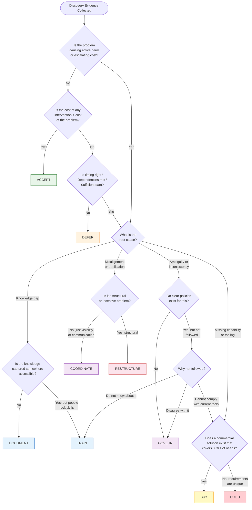

# Solution Type Taxonomy for Enterprise Discovery

## Purpose

This document provides a structured taxonomy of nine solution types for enterprise product discovery. It extends the traditional "build vs. buy" binary into a spectrum of intervention types that more accurately reflect how enterprises actually solve problems. DISCO agents should use this taxonomy during the Synthesis and Convergence phases to recommend the most appropriate solution type based on discovery evidence.

## Why Nine Types Matter

The build-vs-buy framing creates a systematic bias toward technology solutions. In enterprise environments, the majority of problems surfaced during discovery are rooted in coordination failures, knowledge gaps, policy ambiguity, or organizational misalignment -- not missing software. A richer taxonomy prevents the "when you have a hammer" problem and produces recommendations that match the actual root cause.

---

## The Nine Solution Types

### 1. BUILD -- Custom Development

**Definition**: Design and develop new software, tools, or technical systems that do not exist in the market or require deep customization to meet unique organizational needs.

**Evidence Signals from Discovery**:
- Workflows are genuinely novel with no market analogues
- Existing tools were evaluated and failed specific, documented requirements
- The problem requires deep integration with proprietary internal systems
- Competitive advantage depends on unique technical capability
- Scale or performance requirements exceed what commercial tools offer

**Typical Effort/Timeline**: 3-18 months for MVP; ongoing maintenance budget of 15-25% of build cost annually.

**Success Criteria**:
- Solves the specific problem identified in discovery
- Adoption rate exceeds 70% within target user group within 6 months
- Total cost of ownership (TCO) over 3 years is justified vs. alternatives
- Maintenance burden is staffed and sustainable

**Failure Modes**:
- Building what already exists commercially (NIH syndrome)
- Scope creep beyond the validated problem
- Underestimating ongoing maintenance and staffing needs
- Building for edge cases rather than the 80% use case
- No adoption plan -- "if we build it, they will come" thinking

**When This Is the WRONG Choice**:
- The problem is primarily about people, process, or policy
- A commercial solution covers 80%+ of requirements
- The organization lacks engineering capacity or appetite for long-term ownership
- Discovery evidence shows the root cause is coordination, not tooling

---

### 2. BUY -- Purchase Commercial Solution

**Definition**: Acquire an existing commercial product or service (SaaS, license, or managed service) that addresses the identified need with acceptable configuration.

**Evidence Signals from Discovery**:
- Clear market category exists for the problem space
- Multiple vendors offer solutions with relevant feature sets
- Requirements are industry-standard, not organization-unique
- Internal teams express desire for "something like [competitor's tool]"
- Speed to value is a primary constraint

**Typical Effort/Timeline**: 2-6 months for evaluation and procurement; 1-3 months for deployment and onboarding.

**Success Criteria**:
- Covers 80%+ of validated requirements without custom development
- Integration with existing systems is achievable within timeline
- Vendor stability and roadmap alignment confirmed
- TCO is within budget over 3-year horizon

**Failure Modes**:
- Buying a tool to solve a process problem
- Shelfware -- purchasing without an adoption and change management plan
- Vendor lock-in without exit strategy
- Over-buying features that will never be used
- Underestimating integration complexity

**When This Is the WRONG Choice**:
- The problem is about how people work, not what tools they use
- Requirements are so unique that heavy customization would be needed
- Budget constraints make procurement infeasible
- Discovery shows users already have adequate tools but do not use them

---

### 3. GOVERN -- Create/Enforce Policies and Standards

**Definition**: Establish, clarify, or enforce governance frameworks, policies, standards, or decision-making authority to resolve ambiguity or inconsistency.

**Evidence Signals from Discovery**:
- Different teams follow different processes for the same activity
- Stakeholders say "there is no clear policy on this"
- Decisions are made ad hoc with no documented criteria
- Compliance or risk concerns are raised repeatedly
- Escalation paths are unclear or contested

**Typical Effort/Timeline**: 2-8 weeks for policy drafting; 1-3 months for rollout and enforcement mechanism.

**Success Criteria**:
- Policy is documented, accessible, and understood by all affected parties
- Compliance rate exceeds 85% within 3 months of rollout
- Escalation and exception processes are defined and used
- Reduction in ad hoc decision-making observed

**Failure Modes**:
- Creating policy without enforcement mechanism
- Over-governing -- too rigid for the actual risk level
- Policy created in isolation without stakeholder input
- No review cycle -- policy becomes stale

**When This Is the WRONG Choice**:
- The problem is lack of capability, not lack of rules
- Teams understand the policy but lack tools to comply
- Governance overhead would exceed the cost of the problem

---

### 4. COORDINATE -- Align Existing Resources

**Definition**: Improve alignment, communication, or handoffs between existing people, processes, and tools without introducing new technology or organizational changes.

**Evidence Signals from Discovery**:
- "We did not know the other team was doing that"
- Duplicated effort across teams
- Information silos where data exists but is not shared
- Handoff failures between stages of a process
- Stakeholders have the right tools but use them in isolation

**Typical Effort/Timeline**: 1-4 weeks to design coordination mechanism; ongoing lightweight facilitation.

**Success Criteria**:
- Cross-team visibility established and maintained
- Duplicated effort reduced by measurable amount
- Handoff failures decrease
- Stakeholders report improved alignment in follow-up surveys

**Failure Modes**:
- Adding meetings without reducing meetings (coordination overhead)
- Creating a coordination role without authority
- Assuming coordination will self-sustain without a designated owner
- Treating a structural problem as a coordination problem

**When This Is the WRONG Choice**:
- Teams are fundamentally misaligned on goals (needs RESTRUCTURE)
- The problem requires new capabilities, not better communication
- Coordination costs would exceed the cost of the duplication

---

### 5. TRAIN -- Upskill People

**Definition**: Develop and deliver training, enablement, or coaching to help people use existing tools, processes, or frameworks more effectively.

**Evidence Signals from Discovery**:
- Users report tools are "too complicated" or "not useful"
- Feature adoption data shows low usage of available capabilities
- Workarounds exist for problems that current tools already solve
- New hires consistently struggle with the same onboarding gaps
- Stakeholders say "I wish I knew how to..."

**Typical Effort/Timeline**: 1-4 weeks for training design; 2-8 weeks for delivery; ongoing reinforcement.

**Success Criteria**:
- Feature adoption increases measurably post-training
- Workaround frequency decreases
- Self-reported confidence scores improve
- Support ticket volume for trained topics decreases

**Failure Modes**:
- Training on tools that are genuinely inadequate (training cannot fix bad tools)
- One-time training without reinforcement or reference materials
- Training the wrong audience
- No measurement of training effectiveness

**When This Is the WRONG Choice**:
- The tools genuinely do not support the required workflows
- The problem is motivation or incentive, not capability
- Training would be a band-aid over a structural issue

---

### 6. RESTRUCTURE -- Reorganize Teams or Processes

**Definition**: Change organizational structure, team composition, reporting lines, or process ownership to resolve systemic misalignment.

**Evidence Signals from Discovery**:
- Chronic coordination failures despite repeated attempts to align
- Misaligned incentives between teams
- Ownership gaps -- "that is not my team's responsibility"
- Process bottlenecks caused by organizational boundaries
- Decision authority does not match accountability

**Typical Effort/Timeline**: 1-6 months depending on scope; significant change management required.

**Success Criteria**:
- Clear ownership established for previously contested areas
- Bottleneck throughput improves measurably
- Stakeholders report clarity on roles and responsibilities
- Incentive alignment confirmed through behavior change

**Failure Modes**:
- Restructuring without addressing root cause (shuffling deck chairs)
- Underestimating change management effort
- Creating new silos while dissolving old ones
- Restructuring too frequently (organizational whiplash)

**When This Is the WRONG Choice**:
- The problem is solvable through coordination or governance
- The organization recently restructured and has change fatigue
- The real issue is tooling or capability, not structure

---

### 7. DOCUMENT -- Create Knowledge Assets

**Definition**: Produce documentation, playbooks, runbooks, knowledge bases, or decision records that capture institutional knowledge and make it accessible.

**Evidence Signals from Discovery**:
- Tribal knowledge -- "only Sarah knows how to do that"
- Inconsistent execution of the same process by different people
- Repeated questions in Slack/Teams about the same topics
- New team members take months to become productive
- Post-incident reviews reveal "we solved this before but nobody documented it"

**Typical Effort/Timeline**: 1-4 weeks for initial documentation; ongoing maintenance cadence required.

**Success Criteria**:
- Documentation is used (page views, search hits)
- Time-to-productivity for new team members decreases
- Repeated questions decrease in support channels
- Process consistency improves

**Failure Modes**:
- Creating documentation nobody reads (wrong format or location)
- Documentation without an owner or update cadence
- Over-documenting -- too much detail, not enough structure
- Documenting a broken process instead of fixing it first

**When This Is the WRONG Choice**:
- The process itself is broken (document the right process, not the current one)
- The problem is lack of capability, not lack of knowledge
- Information changes too rapidly for static documentation

---

### 8. DEFER -- Consciously Delay Action

**Definition**: Make an explicit, documented decision to delay action until a specified trigger event, date, or condition is met, with a defined review mechanism.

**Evidence Signals from Discovery**:
- The problem is real but the timing is wrong (other priorities, dependencies)
- External factors are changing rapidly (market, technology, regulation)
- Insufficient data to make a confident decision now
- The cost of acting now exceeds the cost of waiting
- A related initiative is in progress that may resolve or redefine the problem

**Typical Effort/Timeline**: 1-2 days to document the defer decision; periodic review per the defined trigger.

**Success Criteria**:
- Defer decision is documented with explicit trigger conditions
- Review cadence is established and followed
- Stakeholders are aligned on the decision to defer
- When the trigger fires, the team acts promptly

**Failure Modes**:
- Deferring without a trigger (becomes "ignore")
- Deferring indefinitely -- no review cadence
- Using defer to avoid difficult decisions
- Not communicating the defer decision to affected stakeholders

**When This Is the WRONG Choice**:
- The problem is causing active harm or escalating cost
- Stakeholders need resolution for their own planning
- The trigger condition is vague or unmeasurable

---

### 9. ACCEPT -- Acknowledge Without Action

**Definition**: Explicitly acknowledge a situation, document the rationale, and choose not to act because the cost of intervention exceeds the cost of the problem.

**Evidence Signals from Discovery**:
- The problem is real but minor in impact
- All intervention options cost more than the problem itself
- The problem is a side effect of a deliberate, beneficial trade-off
- Stakeholders acknowledge the issue but do not prioritize it
- The "problem" is actually normal friction in a healthy system

**Typical Effort/Timeline**: 1 day to document the accept decision and rationale.

**Success Criteria**:
- Decision is documented with explicit rationale
- Stakeholders are informed and aligned
- Monitoring is in place to detect if the situation worsens
- Re-evaluation trigger is defined (even if distant)

**Failure Modes**:
- Accepting without documenting (becomes invisible)
- Accepting to avoid conflict rather than based on analysis
- Not monitoring for escalation
- Stakeholders interpret acceptance as dismissal of their concern

**When This Is the WRONG Choice**:
- The problem is growing or will compound over time
- Stakeholders feel unheard (perception matters)
- Regulatory or compliance requirements demand action

---

## Solution Type Decision Tree

---

## Convergence Output Document Mapping

The solution type determines what kind of Convergence output document the DISCO pipeline should produce.

| Solution Type | Convergence Document Type | Rationale |
|---|---|---|
| BUILD | PRD (Product Requirements Document) | Requires detailed requirements, architecture, and implementation plan |
| BUY | Evaluation Framework | Requires vendor comparison criteria, scoring rubric, and selection process |
| GOVERN | Decision Framework | Requires policy definition, authority mapping, and enforcement mechanisms |
| RESTRUCTURE | Decision Framework | Requires organizational design rationale, RACI, and transition plan |
| COORDINATE | Assessment | Requires alignment plan, communication cadences, and success metrics |
| TRAIN | Assessment | Requires enablement plan, curriculum outline, and effectiveness measures |
| DOCUMENT | Assessment | Requires documentation plan, ownership model, and maintenance cadence |
| DEFER | Assessment | Requires trigger conditions, review cadence, and monitoring plan |
| ACCEPT | Assessment | Requires rationale documentation, stakeholder communication, and monitoring thresholds |

### Document Type Definitions

**PRD (Product Requirements Document)**: Full specification for a build initiative including problem statement, user stories, functional requirements, technical architecture, success metrics, timeline, and resource needs. Used when the recommendation is to create new software.

**Evaluation Framework**: Structured comparison framework for vendor/tool selection including evaluation criteria with weights, must-have vs. nice-to-have requirements, scoring rubric, shortlist methodology, and POC plan. Used when the recommendation is to procure a commercial solution.

**Decision Framework**: Policy or organizational design document including decision rationale, authority and accountability mapping (RACI), implementation plan, enforcement or transition mechanisms, and review cadence. Used when the recommendation requires governance changes or structural reorganization.

**Assessment**: Lightweight action plan including situation analysis, recommended intervention, specific actions with owners, success criteria, timeline, and monitoring approach. Used for coordination, training, documentation, defer, and accept recommendations where a full PRD or framework would be disproportionate.

---

## Compound Solutions

Many enterprise problems require a combination of solution types. The taxonomy supports compound recommendations with a primary and secondary type:

| Pattern | Example |
|---|---|
| GOVERN + DOCUMENT | New policy with supporting playbook and knowledge base |
| BUY + TRAIN | Tool procurement with enablement program |
| COORDINATE + DOCUMENT | Cross-team alignment with shared documentation |
| RESTRUCTURE + GOVERN | Team reorganization with new governance framework |
| BUILD + TRAIN | Custom tool development with user enablement |
| DEFER + DOCUMENT | Delay decision but document current state for future reference |

When recommending compound solutions, the Convergence document type should match the **primary** (highest-effort, highest-impact) solution type.

---

## Agent Usage Guidelines

### For Synthesis Agents
- Use the decision tree to map discovery evidence to solution types
- Document the evidence trail: which specific findings led to the recommended type
- Flag when evidence points to multiple types (compound solution)
- Challenge BUILD and BUY recommendations by checking if simpler types were considered

### For Convergence Agents
- Use the mapping table to select the correct output document template
- Include the solution type rationale in the document header
- For compound solutions, produce the primary document type with a section covering secondary interventions
- Always include "alternatives considered" showing why other solution types were not selected

### Evidence Quality Standards
- Each solution type recommendation must cite at least 3 specific discovery findings
- BUILD recommendations require evidence that simpler alternatives were evaluated and rejected
- ACCEPT and DEFER recommendations require explicit documentation of what would change the decision
